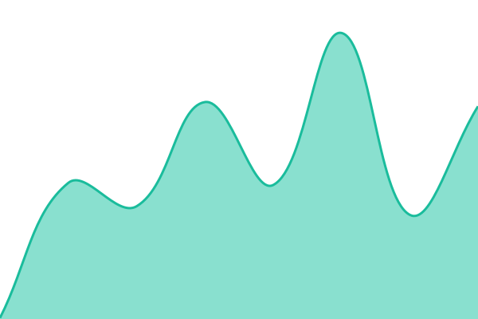
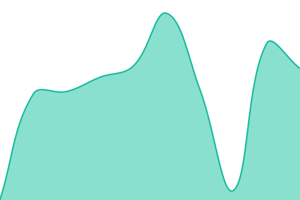

# [📈 Live Status](https://status.hackclub.community): <!--live status--> **🟧 Partial outage**

This repository contains the open-source uptime monitor and status page for [Hack Club Community](https://hackclub.com/), powered by [Upptime](https://github.com/upptime/upptime).

With [Upptime](https://upptime.js.org), you can get your own unlimited and free uptime monitor and status page, powered entirely by a GitHub repository. We use [Issues](https://github.com/hackclub-community/community-services-status/issues) as incident reports, [Actions](https://github.com/hackclub-community/community-services-status/actions) as uptime monitors, and [Pages](https://status.hackclub.community) for the status page.

<!--start: status pages-->
<!-- This summary is generated by Upptime (https://github.com/upptime/upptime) -->
<!-- Do not edit this manually, your changes will be overwritten -->
<!-- prettier-ignore -->
| URL | Status | History | Response Time | Uptime |
| --- | ------ | ------- | ------------- | ------ |
|  [Hack Club Accounts / Auth](https://auth.hackclub.com/up) | 🟩 Up | [auth.yml](https://github.com/hackclub-community/community-services-status/commits/HEAD/history/auth.yml) | 

 210ms
     
 | 

<a href="https://status.hackclub.community/history/auth">100.00%</a>
    

|  [HCB](https://hcb.hackclub.com/up) | 🟩 Up | [hcb.yml](https://github.com/hackclub-community/community-services-status/commits/HEAD/history/hcb.yml) | 

 153ms
     
 | 

<a href="https://status.hackclub.community/history/hcb">100.00%</a>
    

|  [Hackatime](https://hackatime.hackclub.com/up) | 🟩 Up | [hackatime.yml](https://github.com/hackclub-community/community-services-status/commits/HEAD/history/hackatime.yml) | 

 240ms
     
 | 

<a href="https://status.hackclub.community/history/hackatime">100.00%</a>
    

|  [Hackatime Legacy](https://waka.hackclub.com/api/health) | 🟥 Down | [hackatime-legacy.yml](https://github.com/hackclub-community/community-services-status/commits/HEAD/history/hackatime-legacy.yml) | 

 156ms
     
 | 

<a href="https://status.hackclub.community/history/hackatime-legacy">0.00%</a>
    

|  [Community Knot server for Tangled](https://knot.hackclub.community) | 🟥 Down | [tangled-knotserver.yml](https://github.com/hackclub-community/community-services-status/commits/HEAD/history/tangled-knotserver.yml) | 

 0ms
     
 | 

<a href="https://status.hackclub.community/history/tangled-knotserver">0.00%</a>
    

|  [Hack Club Wrapped](https://wrapped.isitzoe.dev) | 🟩 Up | [wrapped.yml](https://github.com/hackclub-community/community-services-status/commits/HEAD/history/wrapped.yml) | 

 431ms
     
 | 

<a href="https://status.hackclub.community/history/wrapped">100.00%</a>
    

|  [Cachet](https://cachet.dunkirk.sh/health) | 🟩 Up | [cachet.yml](https://github.com/hackclub-community/community-services-status/commits/HEAD/history/cachet.yml) | 

 133ms
     
 | 

<a href="https://status.hackclub.community/history/cachet">97.96%</a>
    

<!--end: status pages-->

[**Visit our status website →**](https://status.hackclub.community)

## 📄 License

- Powered by: [Upptime](https://github.com/upptime/upptime)
- Code: [MIT](./LICENSE) © [Anand Chowdhary](https://anandchowdhary.com), supported by [Pabio](https://pabio.com)
- Data in the `./history` directory: [Open Database License](https://opendatacommons.org/licenses/odbl/1-0/)
